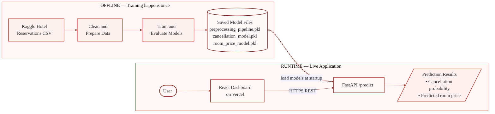

# Hotel Reservations ML — Submission Architecture

```mermaid
%%{init: {'theme': 'base', 'themeVariables': {'fontSize': '20px', 'fontFamily': 'Arial,sans-serif', 'primaryColor': '#fdf2f0', 'primaryBorderColor': '#c0392b', 'primaryTextColor': '#2c2c2c', 'lineColor': '#922b21', 'clusterBkg': '#fff8f7', 'clusterBorder': '#c0392b'}, 'flowchart': {'nodeSpacing': 32, 'rankSpacing': 56, 'padding': 18}}}%%
flowchart LR

  subgraph Offline["  OFFLINE — Training happens once  "]
    direction LR
    CSV["Kaggle Hotel\nReservations CSV"]
    PREP["Clean and\nPrepare Data"]
    TRAIN["Train and\nEvaluate Models"]
    MODELS[("Saved Model Files\npreprocessing_pipeline.pkl\ncancellation_model.pkl\nroom_price_model.pkl")]
  end

  subgraph Runtime["  RUNTIME — Live Application  "]
    direction LR
    USER(["User"])
    REACT["React Dashboard\non Vercel"]
    API["FastAPI /predict"]
    OUT[/"Prediction Results\n• Cancellation probability\n• Predicted room price"/]
  end

  CSV --> PREP --> TRAIN --> MODELS
  MODELS -.->|"load models at startup"| API
  USER --> REACT -->|"HTTPS REST"| API --> OUT

  linkStyle 3 stroke:#7b241c,stroke-width:3.5px,color:#2c2c2c

  classDef off  fill:#fdf2f0,stroke:#c0392b,stroke-width:2px,color:#2c2c2c
  classDef mdl  fill:#fef9f9,stroke:#7b241c,stroke-width:2px,color:#2c2c2c
  classDef run  fill:#fff8f7,stroke:#922b21,stroke-width:2px,color:#2c2c2c
  classDef out  fill:#fef0ee,stroke:#c0392b,stroke-width:2px,color:#2c2c2c

  class CSV,PREP,TRAIN off
  class MODELS mdl
  class USER,REACT,API run
  class OUT out
```
